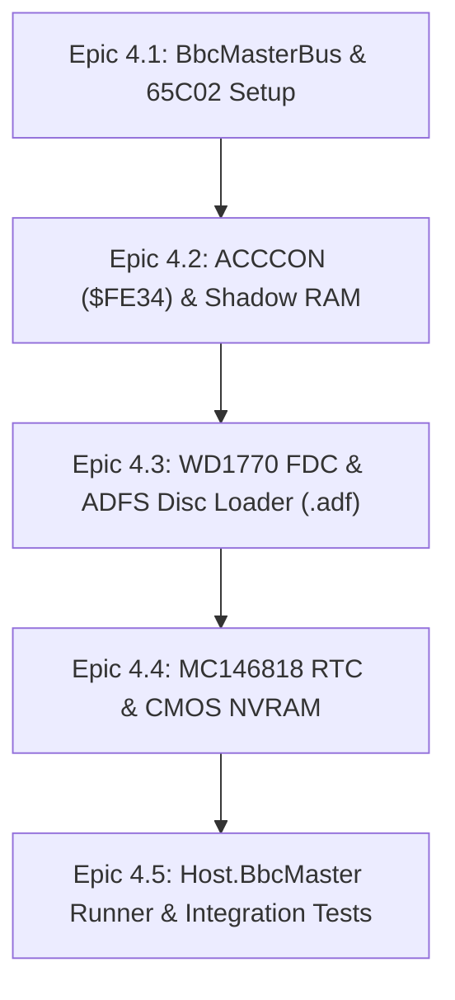

# Acorn BBC Master 128: Technical Architecture & Gap Analysis

This document outlines the technical architecture, component gaps, and step-by-step roadmap for implementing the **Acorn BBC Master 128** (1986) target in `Cpu6502`.

---

## 1. Executive Summary & Hardware Overview

The **BBC Master 128** is the successor to the BBC Micro Model B. While retaining backward compatibility with Model B software, it introduced 128 KB RAM, 128 KB MOS/ROM megabyte mega-ROM, Shadow RAM, a 65C102 processor, an MC146818 CMOS RTC, and a 1770 FDC disk controller.

```
+-------------------------------------------------------------------------+
|                              BBC MASTER 128                             |
|                                                                         |
| +-------------------+  +-------------------+  +-----------------------+ |
| |  WDC 65C102 CPU   |  | 128 KB Main/Shadow|  |  128 KB Mega-ROM      | |
| |   @ 2.0 MHz       |  |   RAM ($0000-7FFF)|  |  (16 Banks x 16 KB)   | |
| +-------------------+  +-------------------+  +-----------------------+ |
|                                                                         |
| +-------------------+  +-------------------+  +-----------------------+ |
| |  WD1770 FDC       |  | MC146818 RTC &    |  | ACCCON ($FE34) Shadow | |
| |  (ADFS / DFS)     |  | 50-byte CMOS RAM  |  | RAM Control Register  | |
| +-------------------+  +-------------------+  +-----------------------+ |
+-------------------------------------------------------------------------+
```

---

## 2. Technical Gap Analysis (Model B vs. Master 128)

| Component | BBC Micro Model B | BBC Master 128 | Gap & Required Implementation |
|---|---|---|---|
| **CPU Instruction Set** | MOS 6502 | WDC 65C102 / 65C02 | Core engine already supports 65C02; instantiate `CpuVariant.C6502` |
| **RAM Architecture** | 32 KB RAM | 128 KB RAM (32 KB Main + 32 KB Shadow + 64 KB Sideways) | Create `BbcMasterBus.cs` with Shadow RAM banking |
| **Shadow Video RAM** | None (RAM shared with BASIC) | 32 KB Shadow RAM ($0000–$7FFF) for video buffers | Implement `$FE34` ACCCON register (Shadow bit 2 toggle) |
| **Sideways RAM/ROM** | 16 Sideways ROM banks | 128 KB Sideways RAM/ROM (Banks 0–3, 4–7 RAM, 8–15 ROM) | Implement Sideways RAM write-enable control |
| **Floppy Disk Controller** | Intel 8271 (Single density DFS) | Western Digital 1770 / 1772 (ADFS / DFS) | Implement `Wd1770Fdc.cs` (ADFS double-density disk loader) |
| **Real-Time Clock / CMOS** | None | Motorola MC146818 RTC & 50-byte NVRAM | Implement `Mc146818Rtc.cs` ($FE30 data / $FE31 address) |
| **Access Control (ACCCON)** | None | `$FE34` ACCCON Register | Implement ACCCON register decoding |

---

## 3. Detailed Component Architecture

### A. ACCCON Register ($FE34)
The Access Control Register controls memory mapping and Shadow RAM:
* **Bit 0 (D)**: RAM bank at `$0000–$7FFF` (0 = Main RAM, 1 = Shadow RAM).
* **Bit 1 (E)**: Video display RAM source (0 = Main RAM, 1 = Shadow RAM).
* **Bit 2 (X)**: Execute from Shadow RAM.
* **Bit 3 (Y)**: Private RAM mapping at `$8000–$9FFF` (HAZEL bank).
* **Bit 7 (T)**: 2 MHz Turbo Mode toggle.

### B. WD1770 Floppy Disk Controller
Replaces the old Intel 8271 FDC to support **ADFS** (Acorn Disc Filing System - 640 KB / 800 KB `.adf` / `.adl` images):
* Command/Status register (`$FE80`), Track register (`$FE81`), Sector register (`$FE82`), Data register (`$FE83`).
* Supports MFM double-density encoding and 512-byte sector sizes.

### C. MC146818 Real-Time Clock & CMOS RAM
* 50 bytes of non-volatile CMOS memory holding boot configurations (`*CONFIGURE`).
* Accessed via address register `$FE30` and data register `$FE31`.

---

## 4. Acorn Tube Coprocessor Interface Architecture ($FEE0–$FEEF)

The **Tube Interface** is Acorn's high-speed dual-bus inter-processor communication system that connects the Host I/O processor (BBC Micro / Master 128) to an external Second Processor (e.g. 65C102 @ 3/4 MHz, Z80 @ 6 MHz, 80186 @ 8 MHz, or ARM1).

```
+---------------------------+                     +---------------------------+
|    HOST I/O PROCESSOR     |                     |     SECOND PROCESSOR      |
|  BBC Micro / Master 128   |                     | (65C102 / Z80 / 80186 /   |
|   (Handles Display, I/O,  |  Tube ULA ($FEE0)   |          ARM1)            |
|     Sound, Keyboard)      | <=================> |  (Executes User Program,  |
|                           |  4 Hardware FIFOs   |    Full 64 KB/512 KB RAM) |
+---------------------------+                     +---------------------------+
```

### Tube ULA Hardware Register Map ($FEE0–$FEEF)

| Register | Host Address | Parasite Address | Capacity | Purpose / Protocol |
|---|---|---|---|---|
| **R1** | `$FEE0` (Status) / `$FEE1` (Data) | `$FEF0` / `$FEF1` | 1 byte | Asynchronous control commands, OSBYTE & OSWORD parameters |
| **R2** | `$FEE2` (Status) / `$FEE3` (Data) | `$FEF2` / `$FEF3` | 1 byte | Command Line Interface (`*` OSCLI strings) |
| **R3** | `$FEE4` (Status) / `$FEE5` (Data) | `$FEF4` / `$FEF5` | 2 bytes | Fast VDU screen graphics & text stream rendering |
| **R4** | `$FEE6` (Status) / `$FEE7` (Data) | `$FEF6` / `$FEF7` | 24 bytes | High-speed block DMA data transfer (Disc/File RAM transfers) |

### Dual CPU Execution Model in `Cpu6502`
To emulate the Tube in `Cpu6502`:
1. Create `TubeUla.cs` containing 4 bidirectional FIFO ring buffers (`R1Fifo`, `R2Fifo`, `R3Fifo`, `R4Fifo`).
2. Map `TubeUla` into Host bus at `$FEE0–$FEEF`.
3. Instantiate a second `Cpu` engine representing the 65C102 Second Processor (Parasite) mapped to its own 64 KB RAM bus.
4. When Parasite writes to VDU or OSBYTE routines, parameters pass through `TubeUla` FIFOs to the Host CPU, leaving full 64 KB RAM free on the Second Processor for user code.

---

## 4. Step-by-Step Implementation Roadmap



1. **Phase 1 (`Machines.BbcMaster`)**: Create project, `BbcMasterBus.cs` with 128 KB RAM allocations and 65C02 CPU.
2. **Phase 2 (Shadow RAM & ACCCON)**: Wire `$FE34` ACCCON register to switch display buffer between Main and Shadow RAM.
3. **Phase 3 (`Wd1770Fdc.cs`)**: Implement WD1770 floppy controller and `.adf` ADFS image parser.
4. **Phase 4 (`Mc146818Rtc.cs`)**: Implement RTC clock & CMOS NVRAM configuration registers.
5. **Phase 5 (`Host.BbcMaster`)**: Build CLI target and comprehensive integration test suite.
